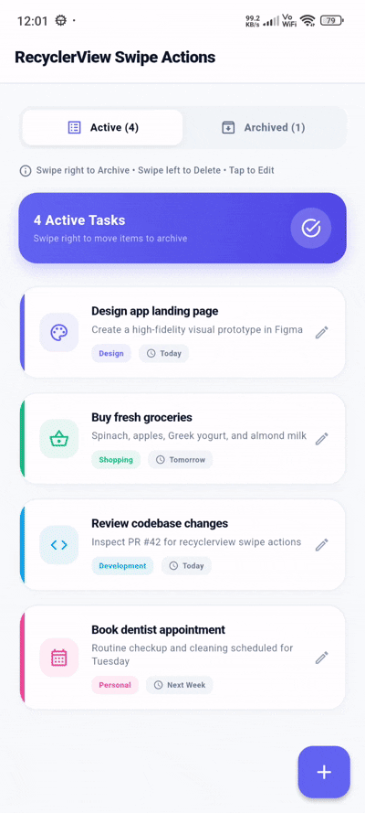

# flutter_recyclerview_edit_delete_archive_swipe

[](https://flutter.dev)
[](https://opensource.org/licenses/MIT)
[](#)

**flutter_recyclerview_edit_delete_archive_swipe** is a premium, highly customizable, and interactive swipe-action list tile package for Flutter. Inspired by modern RecyclerView gesture patterns, it enables intuitive swipe-to-edit, swipe-to-delete, and swipe-to-archive gestures with smooth animations, custom icons, labels, confirmation dialogs, and border radius styling.

---

## 📷 Preview

<p align="center">
  
</p>

*A premium interactive swipe action list tile featuring smooth swipe-to-edit, swipe-to-archive, swipe-to-delete, confirmation dialogs, and custom card border matching.*

---

## ✨ Features

- **⚡ Intuitive Swipe Actions**
  - Effortlessly add swipe-to-edit, swipe-to-delete, and swipe-to-archive gestures to any list item widget (ListTile, Card, Container, etc.).
- **📂 Full Archive & Restore Support**
  - Integrated `onArchive` and `confirmArchive` callbacks to move items between active and archived views easily.
- **🛡️ Built-in Confirmation Handlers**
  - Optional `confirmDelete`, `confirmEdit`, and `confirmArchive` async callbacks to ask users for confirmation before dismissing or executing actions.
- **🎨 High-Fidelity Custom Styling**
  - Custom colors (`editColor`, `deleteColor`, `archiveColor`), custom icons, and customizable text labels.
  - Fully supports `borderRadius` clipping so swipe backgrounds seamlessly align with your card layouts.
  - Custom background widget overrides (`editBackground`, `deleteBackground`, `archiveBackground`) for complete visual freedom.
- **🔄 Flexible Direction Control**
  - Configurable `archiveDirection` allowing you to set whether archiving triggers on swipe-right (`startToEnd`) or swipe-left (`endToStart`).

---

## 📦 Installation

To use this library in your Flutter project, add it to your `pubspec.yaml` dependencies:

```yaml
dependencies:
  flutter:
    sdk: flutter
  # From pub.dev
  flutter_recyclerview_edit_delete_swipe: ^0.0.1
```

Or reference it directly from a Git repository:

```yaml
dependencies:
  flutter_recyclerview_edit_delete_swipe:
    git:
      url: https://github.com/your_username/flutter_recyclerview_edit_delete_swipe.git
      ref: main
```

---

## 🚀 Usage

Import the package in your Dart code:

```dart
import 'package:flutter_recyclerview_edit_delete_swipe/flutter_recyclerview_edit_delete_swipe.dart';
```

### 1. Basic Edit & Delete Swipe
Wrap your list item with `SwipeActionTile`. Swipe right to Edit and swipe left to Delete.

```dart
SwipeActionTile(
  key: ValueKey(item.id),
  borderRadius: BorderRadius.circular(16.0),
  onEdit: () {
    // Perform edit operation
  },
  onDelete: () {
    // Perform delete operation
  },
  child: ListTile(
    title: Text(item.title),
    subtitle: Text(item.subtitle),
  ),
)
```

### 2. Swipe to Archive & Delete
Configure `onArchive` instead of `onEdit` to let users archive items by swiping right.

```dart
SwipeActionTile(
  key: ValueKey(item.id),
  borderRadius: BorderRadius.circular(16.0),
  archiveColor: const Color(0xFFF59E0B), // Amber color
  archiveIcon: Icons.archive_rounded,
  archiveLabel: 'Archive',
  onArchive: () {
    // Move item to archived list
  },
  onDelete: () {
    // Remove item from list
  },
  child: Card(
    child: Padding(
      padding: const EdgeInsets.all(16.0),
      child: Text(item.title),
    ),
  ),
)
```

### 3. Confirmation Dialog Integration
Require user confirmation before deleting or archiving items.

```dart
SwipeActionTile(
  key: ValueKey(item.id),
  borderRadius: BorderRadius.circular(16.0),
  confirmDelete: () async {
    final confirm = await showDialog<bool>(
      context: context,
      builder: (context) => AlertDialog(
        title: const Text('Delete Item?'),
        content: const Text('Are you sure you want to delete this task?'),
        actions: [
          TextButton(
            onPressed: () => Navigator.pop(context, false),
            child: const Text('Cancel'),
          ),
          ElevatedButton(
            onPressed: () => Navigator.pop(context, true),
            child: const Text('Delete'),
          ),
        ],
      ),
    );
    return confirm ?? false;
  },
  onDelete: () {
    // Item is deleted only if confirmDelete returns true
  },
  child: ListTile(
    title: Text(item.title),
  ),
)
```

### 4. Restore / Unarchive Mode
Use `SwipeActionTile` inside an Archived items view with a custom green "Restore" label on swipe right.

```dart
SwipeActionTile(
  key: ValueKey('archived_${item.id}'),
  borderRadius: BorderRadius.circular(16.0),
  archiveColor: const Color(0xFF10B981), // Emerald green
  archiveIcon: Icons.unarchive_rounded,
  archiveLabel: 'Restore',
  deleteLabel: 'Delete Forever',
  onArchive: () {
    // Restore item back to active list
  },
  onDelete: () {
    // Delete item permanently
  },
  child: ListTile(
    title: Text(item.title),
  ),
)
```

---

## 🛠️ API Reference

### `SwipeActionTile` properties:

| Property | Type | Default | Description |
| :--- | :--- | :--- | :--- |
| `key` | `Key` | **Required** | Unique key for widget identification and dismissal animation. |
| `child` | `Widget` | **Required** | The main list item content widget (ListTile, Card, etc.). |
| `onEdit` | `VoidCallback?` | `null` | Callback triggered when swiped to Edit. |
| `onDelete` | `VoidCallback?` | `null` | Callback triggered when swiped to Delete. |
| `onArchive` | `VoidCallback?` | `null` | Callback triggered when swiped to Archive. |
| `confirmEdit` | `FutureOr<bool> Function()?` | `null` | Optional async confirmation callback before editing. |
| `confirmDelete` | `FutureOr<bool> Function()?` | `null` | Optional async confirmation callback before deleting. |
| `confirmArchive` | `FutureOr<bool> Function()?` | `null` | Optional async confirmation callback before archiving. |
| `editBackground` | `Widget?` | `null` | Custom widget for Edit action background. Overrides edit styling. |
| `deleteBackground` | `Widget?` | `null` | Custom widget for Delete action background. Overrides delete styling. |
| `archiveBackground` | `Widget?` | `null` | Custom widget for Archive action background. Overrides archive styling. |
| `editColor` | `Color` | `Colors.blue` | Background color for Edit action. |
| `deleteColor` | `Color` | `Colors.red` | Background color for Delete action. |
| `archiveColor` | `Color` | `Colors.amber` | Background color for Archive action. |
| `editIcon` | `IconData` | `Icons.edit` | Icon displayed for Edit action. |
| `deleteIcon` | `IconData` | `Icons.delete` | Icon displayed for Delete action. |
| `archiveIcon` | `IconData` | `Icons.archive` | Icon displayed for Archive action. |
| `editLabel` | `String` | `'Edit'` | Text label for Edit action. |
| `deleteLabel` | `String` | `'Delete'` | Text label for Delete action. |
| `archiveLabel` | `String` | `'Archive'` | Text label for Archive action. |
| `archiveDirection` | `DismissDirection?` | `null` | Explicit preferred direction for Archive (`startToEnd` or `endToStart`). |
| `iconColor` | `Color` | `Colors.white` | Foreground color for action icons. |
| `textColor` | `Color` | `Colors.white` | Foreground color for text labels. |
| `borderRadius` | `BorderRadius?` | `null` | Border radius applied to swipe background containers. |
| `swipeThresholds` | `Map<DismissDirection, double>?` | `null` | Custom swipe fraction thresholds needed to trigger actions. |

---

## 📄 License

```lic
MIT License

Copyright (c) 2026

Permission is hereby granted, free of charge, to any person obtaining a copy
of this software and associated documentation files (the "Software"), to deal
in the Software without restriction, including without limitation the rights
to use, copy, modify, merge, publish, distribute, sublicense, and/or sell
copies of the Software, and to permit persons to whom the Software is
furnished to do so, subject to the following conditions:

The above copyright notice and this permission notice shall be included in all
copies or substantial portions of the Software.

THE SOFTWARE IS PROVIDED "AS IS", WITHOUT WARRANTY OF ANY KIND, EXPRESS OR
IMPLIED, INCLUDING BUT NOT LIMITED TO THE WARRANTIES OF MERCHANTABILITY,
FITNESS FOR A PARTICULAR PURPOSE AND NONINFRINGEMENT. IN NO EVENT SHALL THE
AUTHORS OR COPYRIGHT HOLDERS BE LIABLE FOR ANY CLAIM, DAMAGES OR OTHER
LIABILITY, WHETHER IN AN ACTION OF CONTRACT, TORT OR OTHERWISE, ARISING FROM,
OUT OF OR IN CONNECTION WITH THE SOFTWARE OR THE USE OR OTHER DEALINGS IN THE
SOFTWARE.
```
